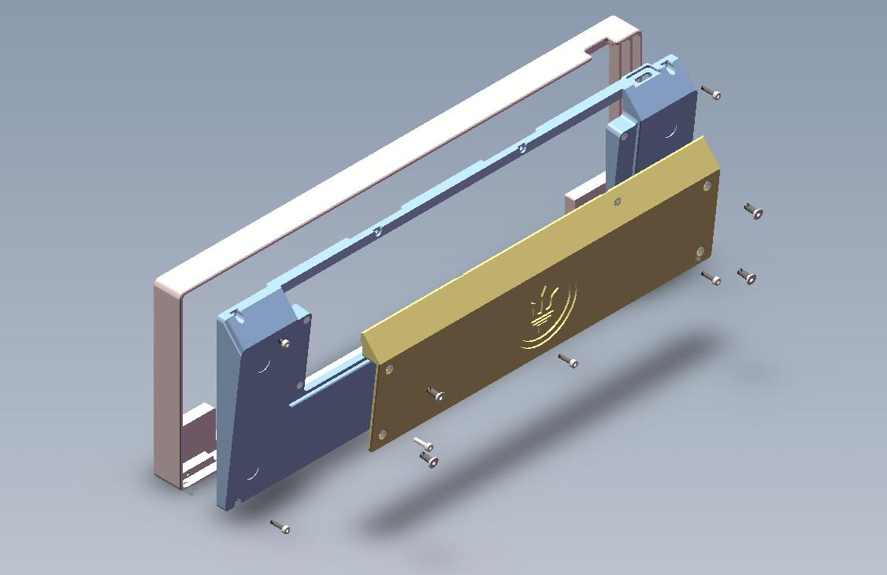
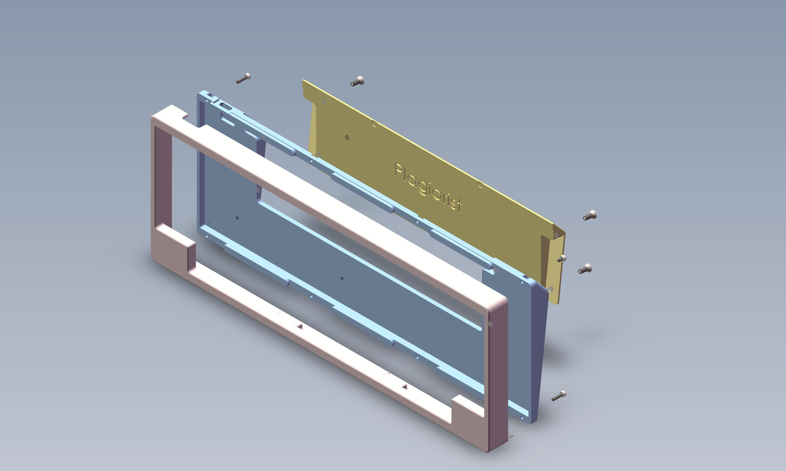

# plagiarist

## 介绍

本工程抄袭自[AI03](https://github.com/ai03-2725)的Polaris
类似hhkb键盘壳子gasket结构

1.  请不要商用
2.  兼容7u空格的60pcb可以使用
3.  真hhkb用不了

## 螺丝规格

| 螺丝     | 规格        | 数量 | 淘宝链接          |
| -------- | ------ | ----- | ----------------- |
| 配重螺丝 | m3x5       | 4 | 7(0bpt2J50P5m):// |
| 壳体螺丝 | m2x8或m2x10 | 8 | 6(1uX12J5bdcz):// |

** gasket垫片，自己拿捏**
** 定位板用北极星**

